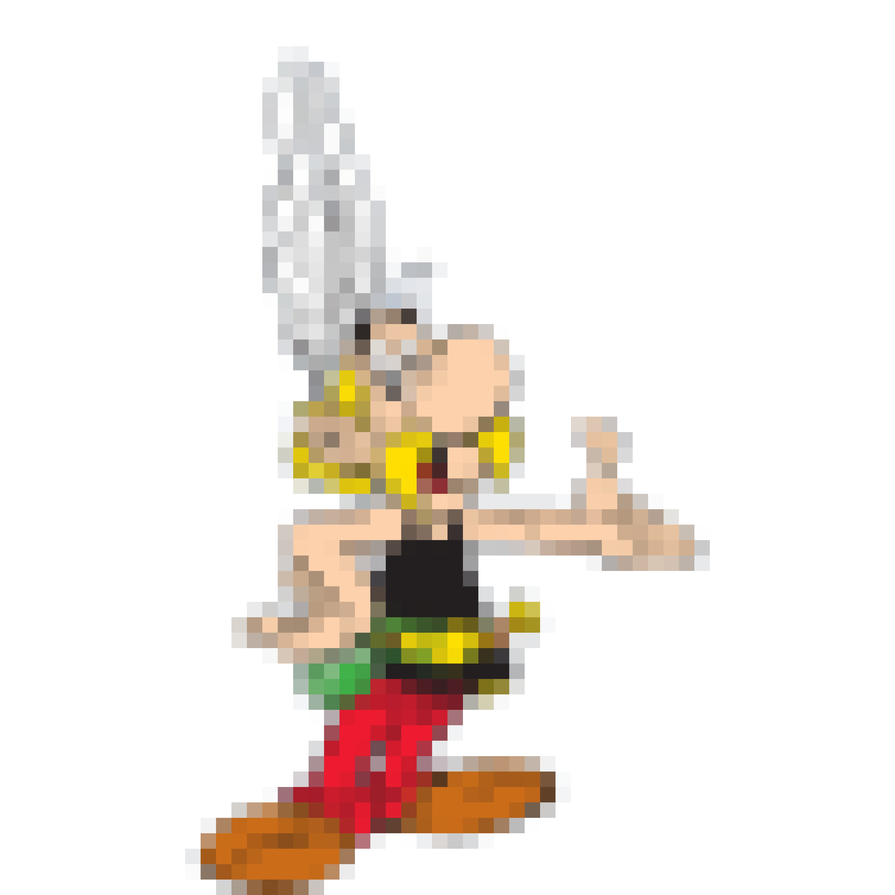

# rasterix: Raster tricks for Xarray

[](https://github.com/xarray-contrib/rasterix/actions)
[](https://rasterix.readthedocs.io/en/latest/?badge=latest)
[](https://pypi.org/project/rasterix/)
[](https://anaconda.org/conda-forge/rasterix)



This WIP project contains tools to make it easier to analyze raster data with Xarray.
It currently has two pieces.

1. `RasterIndex` for indexing using the affine transform recorded in GeoTIFFs.
1. Dask-aware rasterization wrappers around `exactextract`, `rasterio.features.rasterize`, and `rasterio.features.geometry_mask`.

Our intent is to provide reusable building blocks for the many sub-ecosystems around: e.g. `rioxarray`, `odc.geo`, etc.

## Installing

`rasterix` alpha releases are available on pypi

```
pip install rasterix
```
